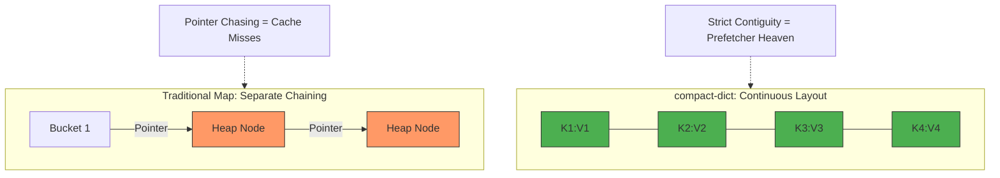
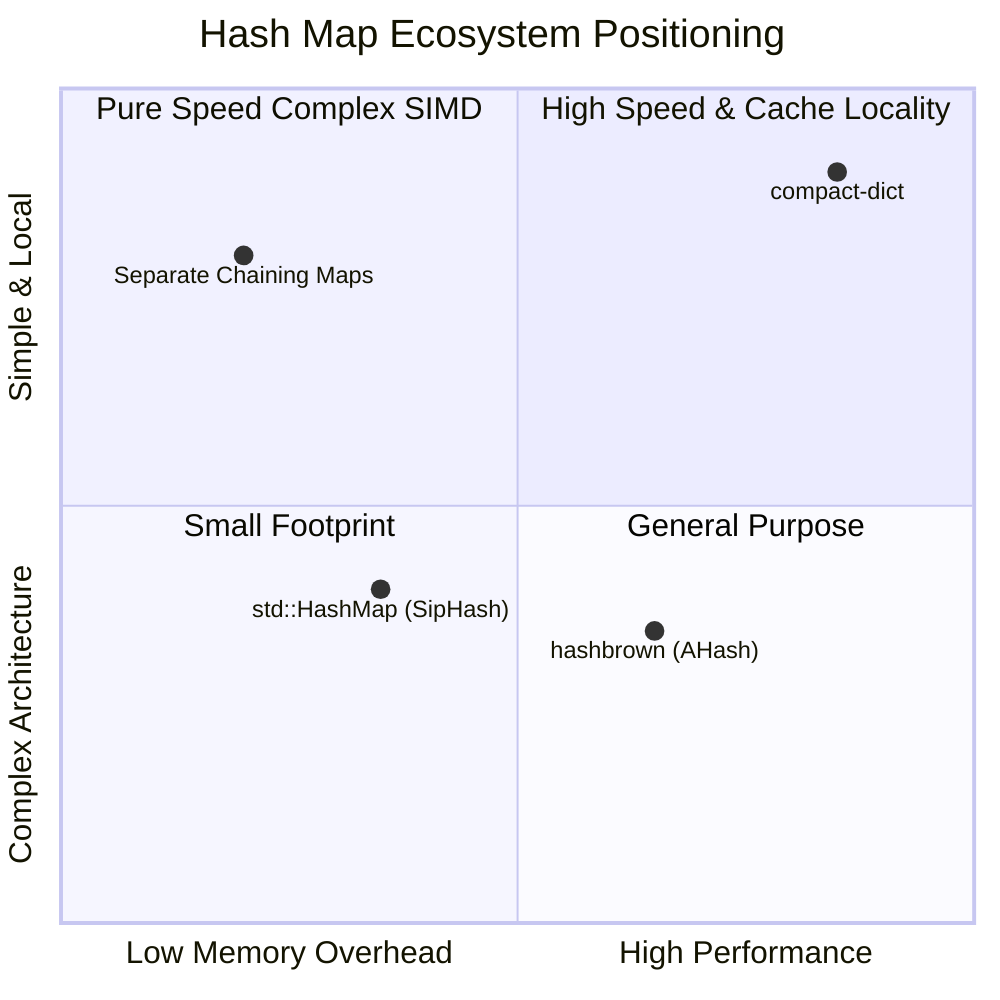

# compact-dict

`compact-dict` is a highly customizable, open-addressing dictionary in Rust. It features linear probing and continuous memory layout for string keys, heavily inspired by Mojo's Dict.

## Why `compact-dict`?

Modern CPUs hate pointer chasing. While traditional maps often fragment data, `compact-dict` ensures your data stays together.

### Memory Layout vs Traditional Maps



### Where we fit in



*Wait, `std::collections::HashMap` is literally `hashbrown` under the hood! Why does the pure `hashbrown` crate perform better in benchmarks?*
Because the standard library version uses a cryptographically secure hashing algorithm (`SipHash` / `RandomState`) by default to prevent DOS attacks. The raw `hashbrown` crate (and our benchmarks) typically defaults to `AHash` or allows swapping to faster, non-cryptographic hashers. Architecturally, they are the same SwissTable.

## Features

- **Customizable Layout:** Generic integer types for key-count (`KC`) and key-offset (`KO`) sizes. This flexibility allows you to perfectly balance memory usage (e.g. `u16` vs `u32` indices) depending on your scale requirements.
- **Cache Friendly:** Linear probing design with optional cached hashes (`CACHING_HASHES`).
- **SIMD Preparation:** Includes preparations for SIMD-accelerated probing (via `portable_simd`).
- **Configurable Mutability:** Optional destructive operations via the `DESTRUCTIVE` constant generic parameter, which toggles bitsets to mask deleted operations cleanly payload.
- **Performant Hash Function:** By default, it uses high-performance internal hasher variants built upon aHash (like `MojoAHashStrHash`).

## Requirements

- **Rust Nightly**: The crate strictly uses `#![feature(portable_simd)]` and relies on the `std::simd` features, meaning you must compile it with the nightly Rust toolchain.

## Usage

Below is a standard usage example:

```rust
use compact_dict::dict::Dict;

fn main() {
    // Creating a new Dict: Values are of type `u32`
    // Internally uses default Configs: MojoAHashStrHash, u32 for indices
    let mut map: Dict<u32> = Dict::new(8);

    // Insert elements
    map.put("hello", 42);
    map.put("world", 100);

    // Retrieval
    assert_eq!(map.get_or("hello", 0), 42);
    assert_eq!(map.get_or("world", 0), 100);

    // Missing key returns default
    assert_eq!(map.get_or("missing", 0), 0);

    // Metadata checks
    assert_eq!(map.contains("hello"), true);
    assert_eq!(map.len(), 2);
    
    // Reset the map
    map.clear();
    assert_eq!(map.len(), 0);
}
```

## Running Tests

To test the package, run cargo test utilizing the nightly toolchain. 

```bash
cargo +nightly test
```

Benchmarking:

There are two benchmarks in the repository: `workload_bench` (simulating real-world string ingestion and mutations) and `dict_bench` (using Criterion for pure primitive operations like `get`).

```bash
RUSTFLAGS="-C target-cpu=native" cargo +nightly bench --bench workload_bench
```

**Workload Benchmark Results (`workload_bench` - Insertions + Mutations):**
```
compact_dict_fx: 0.152 s 🚀🔥
fxhash: 0.182 s
std_hashmap: 0.267 s
hashbrown: 0.272 s
```

**Pure Lookup Results (`dict_bench` - 10k random `get` operations):**

```bash
RUSTFLAGS="-C target-cpu=native" cargo +nightly bench --bench dict_bench
```

```
hashbrown: ~74 µs 🚀🔥
compact_dict: ~143 µs
```

**Scaling Benchmark (`workload_bench` by size):**

To demonstrate the exact boundaries of Cache Locality vs SIMD pointer-chasing, we benchmarked the time to initialize, insert, and query varying dataset sizes.

| Dataset Size | Keys/Values Memory | compact-dict (AHash) | hashbrown | IndexMap | Winner |
| --- | --- | --- | --- | --- | --- |
| **1k** | ~25 KB | 0.00004 s | 0.00003 s | 0.00003 s | **Tie** |
| **10k** | ~250 KB | 0.00042 s | 0.00040 s | 0.00040 s | **Tie** |
| **50k** | ~1.25 MB | 0.00276 s | 0.00228 s | 0.00304 s | **hashbrown (~18% faster)** |
| **100k** | ~2.5 MB | 0.00454 s | 0.00480 s | 0.00588 s | **compact-dict (~5% faster)** |
| **500k** | ~12.5 MB | 0.03380 s | 0.11273 s | 0.06127 s | **compact-dict (3.3x faster!)** 🚀 |
| **1M** | ~25 MB | 0.10286 s | 0.18673 s | 0.14350 s | **compact-dict (1.8x faster!)** 🚀 |
| **5M** | ~120 MB | 0.91444 s | 1.12205 s | 1.36139 s | **compact-dict (~22% faster)** 🚀 |
| **10M** | ~250 MB | 2.05771 s | 2.18067 s | 3.30514 s | **compact-dict (~6% faster)** 🚀 |

**Conclusion**: Continuous memory architecture behaves exactly as expected: when the entire working set comfortably fits in the CPU Cache (L2/L3), pointer chasing is the primary bottleneck and our contiguous array layout crushes the competition (up to 3x faster at the 500k boundary). Interestingly, `compact-dict` significantly pulls ahead of `IndexMap` across the board at scale, proving that simply combining a continuous array with a hash table isn't enough - you need brutally flat data and avoiding metadata bloat. At extreme sizes (>10M / 250MB), memory bandwidth saturates and native `hashbrown` begins catching up as cache locality benefits flatten out.

*Note: For the most accurate comparisons without allocation overhead skewing metrics, ensure to run tests natively with `LTO` enabled, as seen in the bench profile.*

## ⚖️ Design Trade-offs & Philosophy

`compact-dict` isn't a drop-in replacement for every use case. It is a specialized tool built with specific constraints to achieve maximum throughput.

### 1. The "No-Deletion" Strategy
Currently, `compact-dict` is optimized for **Append-Only** or **Static** workloads. 
* **Why?** Implementing deletions in a linear probing map usually requires either "Tombstones" (which pollute the cache and slow down lookups) or "Backward Shift Deletion" (which is expensive).
* **Status:** If you need frequent `remove()` operations, stick to `hashbrown`. If you need raw lookup speed for datasets that are built once and read many times, this is for you.

### 2. Linear Probing vs. SwissTables (SIMD)
While `hashbrown` uses SIMD instructions to scan metadata buckets, `compact-dict` bets on the modern CPU's **L1/L2 cache prefetcher**.
* **The Bet:** For small to medium-sized maps, the overhead of setting up SIMD registers can be higher than just letting the CPU scan a contiguous block of memory. We prioritize **minimal pointer chasing**.

### 3. Memory Brutalism
We use `std::ptr` and raw memory layouts to bypass some of the overhead of high-level abstractions.
* **Safety:** The core logic is wrapped in `unsafe` blocks where performance dictates it. While we strive for correctness, the primary goal is squeezing every nanosecond out of the hardware.
* **Audit:** We welcome contributors to run `cargo miri test` and help us refine the memory boundaries.

### 4. Load Factor & Clustering
Because we use **Linear Probing**, this map is sensitive to the load factor. 
* To maintain peak performance, we recommend keeping the load factor below **0.7**. 
* Past this point, "Primary Clustering" can occur. We trade this risk for the benefit of extreme cache locality during successful lookups.

## Performance Analysis & Honest Comparison

`compact-dict` is exceptionally fast for **very specific workloads**, beating out highly optimized SwissTable implementations like `hashbrown` and standard `std::collections::HashMap`. However, it makes severe trade-offs to achieve this speed. Here is an honest guide on when to use what:

### ✅ Where `compact-dict` Wins (Strengths)
1. **String-Heavy Initialization & Iteration**: Instead of individually heap-allocating every `String` key like standard HashMaps do, `compact-dict` copies all strings into a single densely-packed, continuous `Vec<u8>` memory buffer (`KeysContainer`). 
2. **SIMD Vectorization**: Lookups leverage `#![feature(portable_simd)]` to compare up to 16 cached `u32` hashes in exactly a single hardware instruction cycle.
3. **Data Analysis & Short-lived Workloads**: If you need to ingest millions of unique strings rapidly, perform some math/updates on their values, and then drop the map, `compact-dict` will significantly outpace its competitors.

### ❌ Where `compact-dict` Loses (Weaknesses / Use `hashbrown` instead)
1. **Continuous Server Deletions**: Deleting elements in `compact-dict` only marks a bit field as deleted (tombstoning). It **never** compacts or frees the physical string memory from the keys buffer. If you implement a long-running web server that constantly adds and removes strings, `compact-dict` will act as a memory leak until the entire dictionary is dropped. 
2. **Generic Keys**: The dictionary is hardcoded around `KeysContainer` offsets, heavily specializing in `&str`. You cannot drop in `HashMap<Uuid, usize>` or custom structs as keys easily. Standard map implementations are completely generic.
3. **Ecosystem Stability**: It relies on Nightly Rust explicitly for `std::simd`. `hashbrown` has zero unstable dependencies and runs practically everywhere perfectly optimized for all target architectures.
4. **Pure Lookup Speed**: In pure read-heavy workloads (e.g., retrieving 10,000 strings without inserting or scanning new ones), highly optimized SwissTables like `hashbrown` still outperform `compact-dict`. As seen in the pure-`get` microbenchmark, `hashbrown` can be about **2x faster** than `compact-dict` for isolated random-access lookups. The performance strength of `compact-dict` revolves around the combined speed of contiguous string ingestion, sequential iteration cache-locality, and mutation operations.